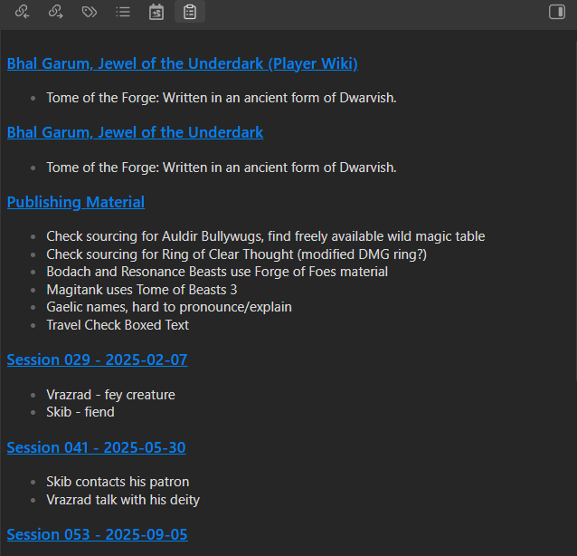

# TODO Lister

A plugin for Obsidian to manage all of your "TODOs."

When I'm using Obsidian to write, I typically make notes prefixed or ending with "TODO" to remind myself what I need to return to. Sometimes, it's hard to remember where those were, and to return to them.

TODO Lister will search all of your markdown files for any lines that contain "TODO" (see below for a detailed process), and then build a list of those notes grouped by file.

# Credits

Based on Obsidian's sample plugin.

# Process and UI

TODO Lister steps through each Markdown file in the vault. It converts each file to plain text (stripping Markdown code). Then, it runs the following checks on each line in the result, returning the first match as a TODO entry for that file:

-   If a line contains TODO: followed by text, it returns everything that follows it.
-   If a line ends with TODO, it returns everything that preceded it.
-   If a line contains TODO between other text, it returns the entire line.
-   If a line contains _only_ TODO, it returns the previous line. If that's blank, it returns the following lines until it hits a blank line or the end of the file.

Lines that don't match any of these tests are ignored.

TODO Lister has one view, which lists each file (with a link to open it as a new tab) with a bulleted list of TODO's under it.

Creating, modifying, deleting, or renaming a Markdown file will reprocess it, and TODO Lister will update the view to match the new results.
